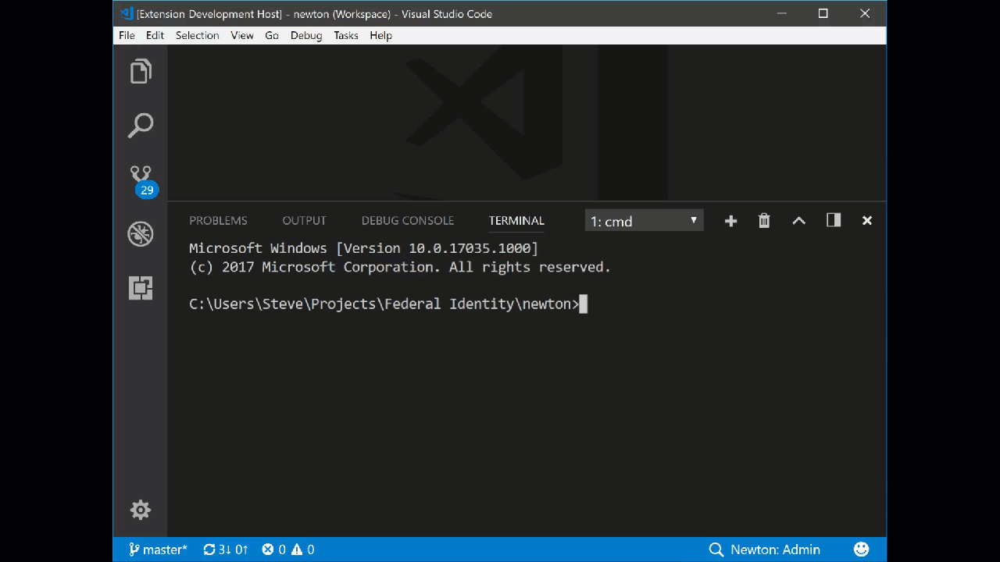

# Team Essentials   

<!--  -->

 

<small>[2017.11.13]</small> **[New]** The Multi-root Update is here! See what's changed either in the [release notes](https://github.com/SteveHartzog/team-essentials/wiki/Multi-Root-Update) or for devs the [CHANGELOG](https://raw.githubusercontent.com/SteveHartzog/team-essentials/master/CHANGELOG.md).

## Description
Team Essentials helps you define a default environment for your team:
 - **Filter Explorer**: Quick filtering of the explorer view to groups that _you_ define, allowing team members to easily switch between them without committing their _local_ choice to source control. This filter can be selected easily by clicking on the the Team Essentials statusbar section.
   > Note: This requires your team settings to be moved (see below) and added to your `.gitignore` either manually or using the configuration wizard.
 - **Statusbar**: The statusbar shows the current workspace filter (with workspace name if in multi-root). Clicking it runs the Filter Explorer selector.
 - **Team Settings**: In order to support dev local explorer filters (without committing each team members' filter), the `.vscode/settings.json` is added to `.gitignore`. Project-wide settings should be placed in either the multi-root workspace file `{name}.vscode-workspace`, or in single root workspaces the `.vscode/team-essentials/settings.json`. Full schema support is available for autocompletion of settings in both locations.
 - **Required Extensions**: Providing an easy way for team member's to install recommended and required extensions. Also, **force installs required extensions** upon initial project load by a new team member that _you_ define (if Team Essentials is already installed).
 - **Debug Layouts** Allows _you_ to define default debug views when the dev starts or ends a debug session (e.g. switch to debugger, show debug console on start) <small>[:link: [wiki doc](https://github.com/SteveHartzog/team-essentials/wiki/Debugging-View-Modes)]</small>

If you have any feature suggestions, or would like to contribute (I need all the help I can get), please checkout the [Contributing Guidelines](https://github.com/SteveHartzog/team-essentials/blob/master/CONTRIBUTING.md).

# Feature Screenshots
* [Change Workspace Shell](#change-workspace-shell) <small>[:link: [wiki doc](https://github.com/SteveHartzog/team-essentials/wiki/Change-Workspace-Shell)]</small>
* [Filter Explorer](#filter-explorer) <small>[:link: [wiki doc](https://github.com/SteveHartzog/team-essentials/wiki/Filter-Explorer)]</small>
* [Update Extensions](#update-extensions) <small>[:link: [wiki doc](https://github.com/SteveHartzog/team-essentials/wiki/Update-Extensions)]</small>

## Change Shell

[ :arrow_heading_up: ](#feature-screenshots)

## Filter Explorer

[:arrow_heading_up:](#feature-screenshots)

## **Update Extensions**

[:arrow_heading_up:](#feature-screenshots)
