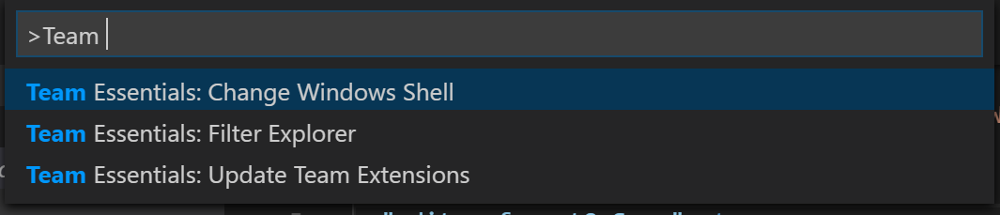
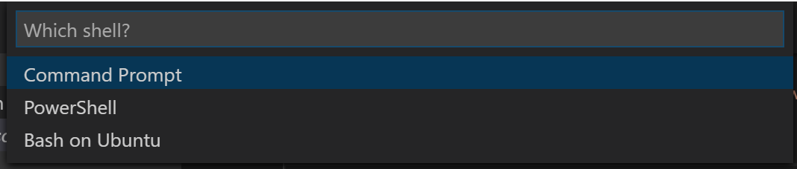
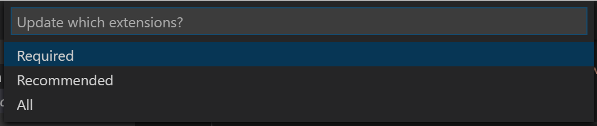
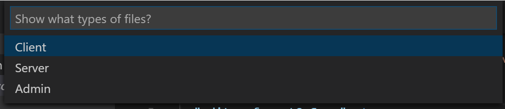

# Team Essentials
  

  Team essentials was designed to help team leads to define default settings, default extensions and allow easy configuration per developer within the constraints provided by the team lead. For instance required extensions are installed when the extension is installed or the project is opened for the first time.

## Features

* **Change Workspace Shell**: You can change your workspace shell (Windows only currently) using a quickpick.
  

* **Team Extension management**: You can define a list of required Team extensions (recommended extensions comes out of the box) that must be installed. These extensions are installed the first time the project is loaded with Team Essentials. You can also run it manually with a quickpick for required, recommend or all as options.
  

* **Team Explorer filter**: You can define different groups of files to be be excluded. For instance, one for nodejs backend and one for frontend devs. A `default` group will be applied in addition to group filters to all but the `admin` filter. Developers can then set their desired filter with a quickpick.
  

## Extension Settings

### Custom files:
* `.vscode/team.json` is where the team settings are included.
* `.vscode/user.json` is where the local developers settings are saved.

### Default .vscode files:
* `.vscode/settings.json` is where Team Essentials will write local workspace settings.
* `.vscode/extensions.json` is where Team Essentials gets the list of recommended extensions.

This extension contributes the following settings:

* `teamEssentials.changeWindowsShell`: Allows a quick way to set your project shell (in Windows).
* `teamEssentials.filterExplorer`: Filters the source view, by developer instance to project defined filters.
* `teamEssentials.updateExtensions`: Runs by default on first load of the project if a team.json has `required.extensions` key.

### Debugging
When you start a debugging session, the debug view and console are shown.

When you stop a debugging session with `shift+f5`, the explorer view and output window are shown.

## Release Notes

### 0.2.0

First published version of Team Essentials.