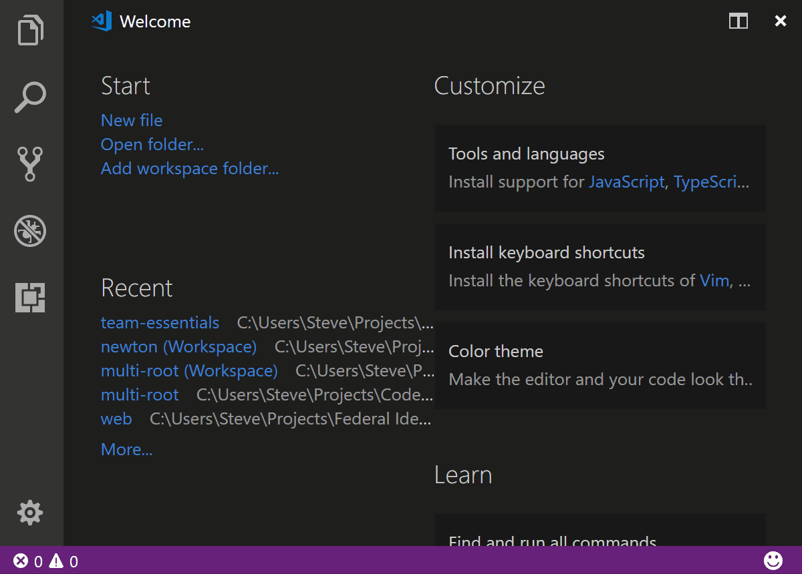

# Team Essentials
[](https://marketplace.visualstudio.com/items?itemName=SteveHartzog.team-essentials)
[](https://marketplace.visualstudio.com/items?itemName=SteveHartzog.team-essentials)
[](https://vsmarketplacebadge.apphb.com/rating/SteveHartzog.team-essentials.svg)
[](https://david-dm.org/SteveHartzog/team-essentials)
[](https://david-dm.org/SteveHartzog/team-essentials#info=devDependencies)


Team Essentials helps you define a default environment for your team by:
 - Providing default VS Code settings for your project
 - Providing an easy way for team member's to install recommended and required extensions
 - Force installing required extensions upon initial project load by a new team member that _you_ define (if Team Essentials is already installed)
 - Quick filtering of the explorer view to groups that _you_ define, allowing team members to easily switch between them without committing their _local_ choice to source control
 - Allowing _you_ to define default debug views when the dev starts or ends a debug session (e.g. switch to debugger, show debug console on start) <small>[:link: [wiki doc](https://github.com/SteveHartzog/team-essentials/wiki/Debugging-View-Modes)]</small>
 - _Future_: GitHub Issues Integration (see [#2](https://github.com/SteveHartzog/team-essentials/issues/2) for more info)

If you have any feature suggestions, or would like to contribute (I need all the help I can get), please checkout the [Contributing Guidelines](https://github.com/SteveHartzog/team-essentials/blob/master/CONTRIBUTING.md).

> Don't forget to do the [after-installation steps](#after-installation-steps) prior to using this extension.


# Feature Screenshots
* [Change Workspace Shell](#change-workspace-shell) <small>[:link: [wiki doc](https://github.com/SteveHartzog/team-essentials/wiki/Change-Workspace-Shell)]</small>
* [Filter Explorer](#filter-explorer) <small>[:link: [wiki doc](https://github.com/SteveHartzog/team-essentials/wiki/Filter-Explorer)]</small>
* [Update Extensions](#update-extensions) <small>[:link: [wiki doc](https://github.com/SteveHartzog/team-essentials/wiki/Update-Extensions)]</small>

## Change Workspace Shell

[:arrow_heading_up:](#feature-screenshots)

## Filter Explorer

[:arrow_heading_up:](#feature-screenshots)

## **Update Extensions**

[:arrow_heading_up:](#feature-screenshots)


# After installation steps
> **NOTE**: This extension will not work until you follow these steps.

1. Add the following files to your `.gitignore`:
   ```shell
   .vscode/settings.json
   .vscode/user.json
   ```
  
2. Remove `.vscode/settings.json` from source control if it had been added previously.
3. Create a `.vscode/team.json` to configure your teams' settings. See the [config page](https://github.com/SteveHartzog/team-essentials/wiki/Configuration) on the wiki for more information.

[:arrow_heading_up:](#team-essentials)
